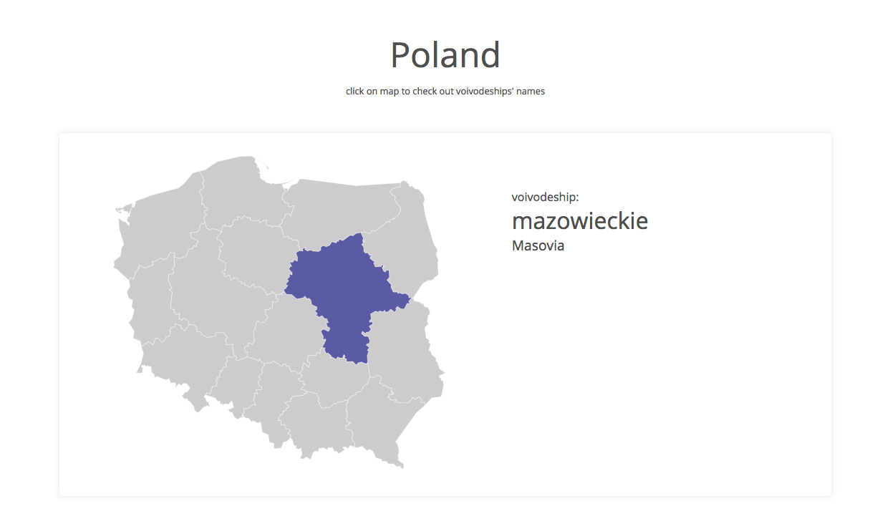
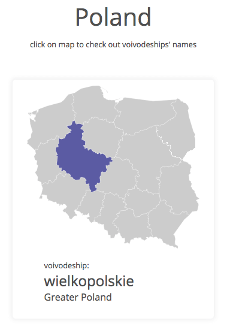

# Interactive Map of Poland 

This is Poland's administrative map in SVG. By clicking on voivodeships you can change data displayed next to the map.


## Getting Started

To run this project you need to have **Node.js** and **Webpack** installed on your local machine. After forking and cloning the repo please run these commands in your command line:

```
npm install
```

and

```
npm start
```

Then open the **.html** file in your browser.


## Tools

- object oriented JavaScript (ES6)
- CSS
- RWD
- Webpack


## Demo

#### [Interactive Map of Poland](https://karin-on.github.io/interactive-map/) 


## Previews





